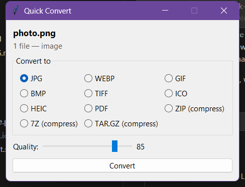

# Quick Convert

Right-click any file in Windows Explorer -> **Quick Convert** -> pick a target
format -> the converted copy appears next to the original (originals are never
modified; name clashes become `name (1).ext`).

<p align="center">
  
</p>

Select multiple files to batch-convert them in one window; select images and
choose PDF to optionally combine them into a single document. Right-clicking a
folder offers compression (zip / 7z / tar.gz).

## Supported conversions

| Family | Read | Write |
|---|---|---|
| Images | png, jpg, webp, bmp, tiff, gif, ico, heic, heif, avif | png, jpg, webp, gif, bmp, tiff, ico, heic, pdf |
| Video | mp4, mkv, mov, avi, webm, wmv, flv, m4v, mpg, ts, 3gp | mp4, mkv, mov, avi, webm, gif + audio extraction |
| Audio | mp3, wav, flac, aac, ogg, m4a, wma, opus, aiff | mp3, wav, flac, m4a, ogg, opus, aac |
| Documents | docx, md, html, odt, rtf, epub, txt, tex | docx, pdf, md, html, odt, rtf, epub, txt |
| PDF | pdf | docx, txt, png/jpg (per page) |
| Archives | zip, 7z, tar, tar.gz/tgz, tar.bz2, tar.xz, gz | extract, or repack/compress to zip, 7z, tar.gz |

## Install

Two editions are published on the Releases page. Both install per-user under
`HKCU` (no admin) and run with **no background process** - the menu survives
reboot and sign-out. By default the entry appears under Windows 11's **"Show
more options"** (or Shift+F10), leaving the fast compact menu untouched.

### Standalone - no Python needed (recommended for most people)

Download `QuickConvert-Standalone-vX.Y.Z.zip`, extract it to a permanent folder
(e.g. your Documents - not a temporary folder you'll delete later), and
double-click **Install.bat**. It registers the right-click entry and, through
winget, installs FFmpeg and Pandoc if they are missing. Remove it any time with
**Uninstall.bat**.

The exe is unsigned, so Windows SmartScreen may warn on first run - click
**More info -> Run anyway**.

### Source - smaller download, requires Python (for developers)

Needs Python 3.10+ and FFmpeg on your PATH. Extract
`QuickConvert-Source-vX.Y.Z.zip`, then in PowerShell from that folder:

```powershell
powershell -ExecutionPolicy Bypass -File .\install.ps1   # pip deps + Pandoc + registry
.\uninstall.ps1                                           # removes it
```

### Top-level menu (optional)

To put Quick Convert at the **top level** of the right-click menu instead of
under "Show more options", opt into the Windows 11 classic full menu - but note
it makes every right-click a little slower (it re-enables all legacy shell
extensions system-wide):

```powershell
.\install.ps1 -ClassicMenu               # source edition
QuickConvert.exe --install --classic-menu   # standalone edition
```

## Engines

- **FFmpeg** - video/audio (must be on PATH; `winget install Gyan.FFmpeg`)
- **Pillow / pillow-heif** - images
- **Microsoft Word or LibreOffice** - DOCX/ODT/RTF -> PDF at full fidelity
  (Word is used if installed, otherwise LibreOffice headless)
- **Pandoc** - document format conversions (docx/md/html/odt/rtf/epub/txt);
  Markdown/HTML -> PDF renders through Edge headless
- **pdf2docx / PyMuPDF** - PDF to docx/text/images
- **py7zr + stdlib** - archives

## Known limits

- `.rar` is proprietary - not supported (use 7-Zip/WinRAR).
- PDF -> DOCX is best-effort; complex layouts won't be pixel-perfect.
- Animated GIF/WebP keep their frames when the target is WEBP or GIF; other
  image targets (JPG, PNG, ...) save the first frame only.
- DOCX/ODT/RTF -> PDF preserves the original formatting via Microsoft Word (if
  installed) or LibreOffice; with neither present it falls back to a simplified
  HTML layout. Markdown/HTML -> PDF is rendered fresh (no source layout to keep).
- Converting an untrusted document may fetch remote resources it references -
  convert only files you trust.
